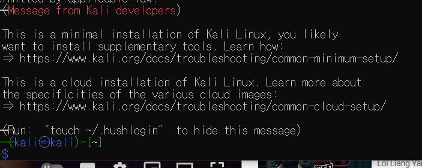
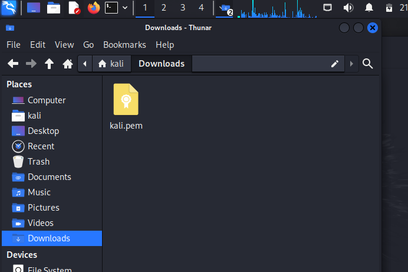
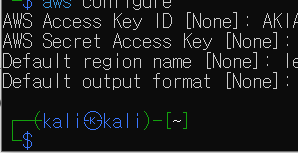
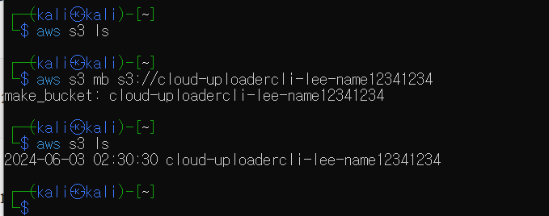
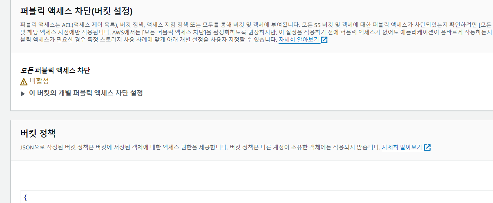
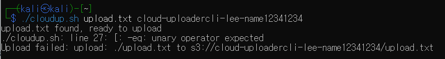
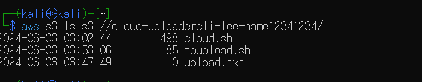

# In here i am going to make bash-based CLI to upload the file on cloud
## I am going to use kali linux because i used it for linux tutorial
## And i chose AWS for the cloud provider

# 1. install the AWS in the Kal
https://www.youtube.com/watch?v=QWQ-LQL1owE&t=66s
#### I follow this guide-line
### 1. make a account in AWS

## Now i get into the kali linux connected to AWS cloud

### And to move into kali i copy the file in to trashbox and copy to the /Downloads in kali

### I failed to run in kali so i am on my cmd to run aws
## aws configure
## got the access key from the AWS web-site
 
### There was nothing in my bucket but i made file

### I change the bucket policy

## I download the leafpad
### TO download you need to do apt get update
#### then install the leafpad
## in cmd i cannot open the leafpad display
## so i choose nano to use

### I wrote the code and i ran the code but i saw the error
### unary operation occured in blank file or some syntax error
### so i made dummy syntax for the safety

## Then i check the bucket there was the file even show me a unary error
### it means i already success to upload the error